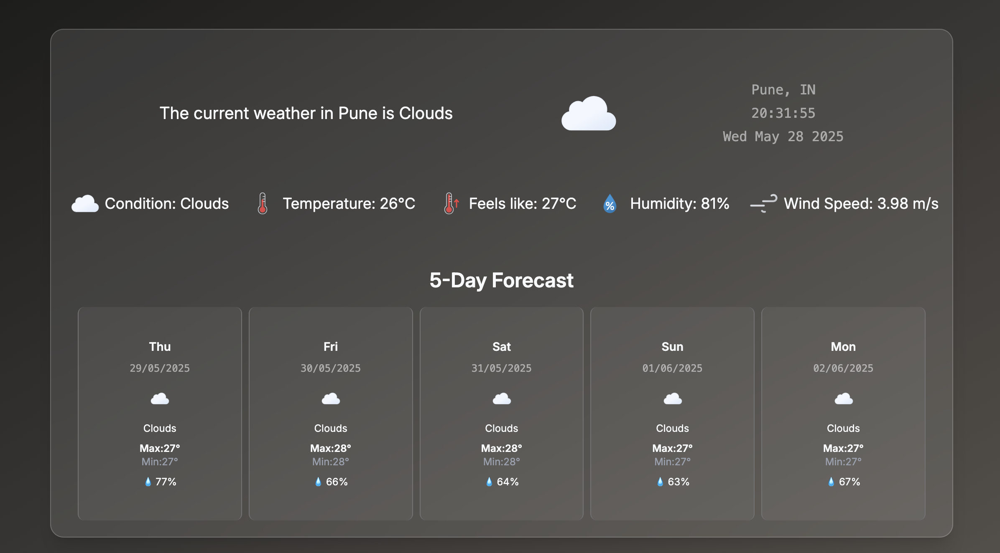
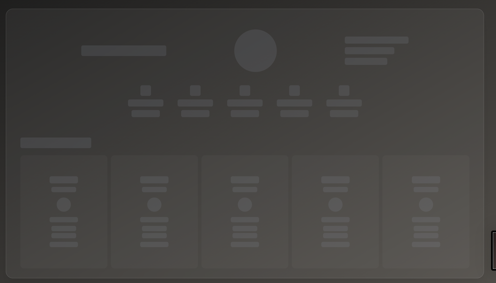
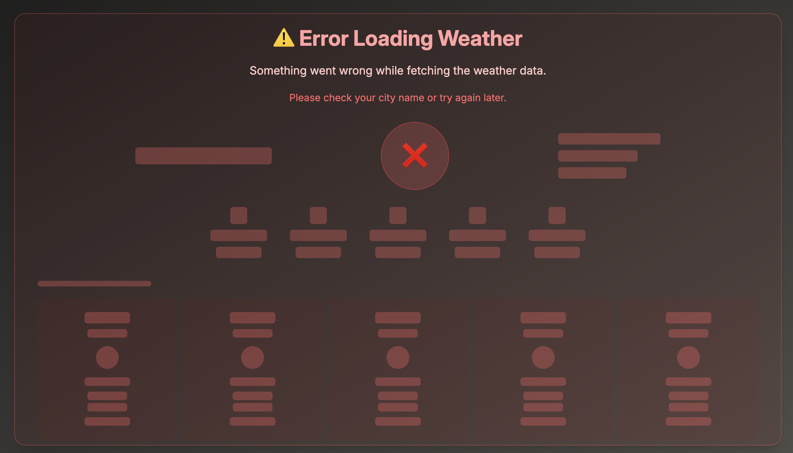

# Weather Dashboard App

A modern, responsive weather application built with React that provides current weather conditions and a 5-day forecast for any city worldwide.

## 🌟 Features

- **Real-time Weather Data**: Get current weather conditions for any city
- **5-Day Forecast**: Extended weather forecast with detailed information
- **Beautiful UI**: Modern glassmorphism design with weather-themed backgrounds
- **Weather Icons**: High-quality meteocons for better visual representation
- **Responsive Design**: Works seamlessly on all device sizes
- **Loading States**: Custom loading animations and skeleton screens
- **Detailed Metrics**: Temperature, humidity, wind speed, and "feels like" temperature

## 🛠️ Tech Stack

- **Frontend**: React.js
- **Styling**: Tailwind CSS
- **Weather API**: OpenWeatherMap API (Free Tier)
- **Icons**: Basmilius Weather Icons

## 📋 Prerequisites

Before running this project, make sure you have:

- Node.js (v14 or higher)
- npm or yarn package manager
- OpenWeatherMap API key (free at [openweathermap.org](https://openweathermap.org/api))

## 🚀 Installation & Setup

1. **Clone the repository**
   ```bash
   git clone https://github.com/apurvp13/qodexweather.git
   cd weather-dashboard
   ```

2. **Install dependencies**
   ```bash
   npm install
   # or
   yarn install
   ```

3. **Set up environment variables**
   Create a `.env` file in the root directory:
   ```env
   REACT_APP_WEATHER_API_KEY=your_openweathermap_api_key_here
   ```

4. **Start the development server**
   ```bash
   npm start
   # or
   yarn start
   ```

5. **Open your browser**
   Navigate to `http://localhost:3000`

## 🏗️ Project Structure

```
src/
├── components/
│   └── DashSkeleton.jsx       # loading skeleton
│   └── ErrorSkeleton.jsx      # error skeleton
├── Api/
│   └── weatherApi.js       # Weather API integration
├── Pages/
│   └── Dashboard.jsx        # Main dashboard component
├── App.js                  # Main app component
├── index.js               # Entry point
└── index.css              # Global styles
```


#### Data Processing
- **Daily Forecast Extraction**: Filters 3-hourly forecast data to get one reading per day (12:00:00)
- **Error Handling**: Implements comprehensive error handling for API failures
- **Loading States**: Provides visual loading feedback with custom animations

#### UI/UX Design Choices
- **Glassmorphism Effect**: Modern frosted glass design using Tailwind CSS
- **Loading Skeletons**: Animated skeleton screens during data fetching
- **Error States**: User-friendly error messages with retry options
- **Contextual Icons**: Weather condition-specific icons with day/night variants
- **Responsive Layout**: Grid-based forecast display that adapts to screen size

## 🌤️ API Limitations & Solutions

### Challenge: OneCall API Paywall
**Problem**: OpenWeatherMap's OneCall API (which provides 8-day forecasts) requires a paid subscription.

**Solution**: Combined free APIs:
- Current weather API for real-time data
- 5-day forecast API for predictions
- Custom data processing to merge responses


## 📱 Screenshots

### Desktop View

### Loading Skeleton

### Error Skeleton



## 🙏 Acknowledgments

- [OpenWeatherMap](https://openweathermap.org/) for weather data API
- [Basmilius Weather Icons](https://github.com/basmilius/weather-icons) for beautiful weather icons
- [Tailwind CSS](https://tailwindcss.com/) for utility-first styling
